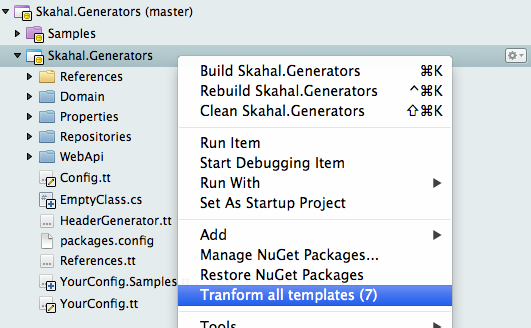

MonoDevelop.ThoseMissingFeatures
================================

Add-in to add those missing features we would like to see in MonoDevelop.

--------

# Features
 - Transform All Templates
 	- This command will transtorm all T4 templates of your current selected project.
 	
 
--------
# Requirements
 - MonoDevelop 4.0+ or Xamarin Studio 4.0+
 - Mono 2.10.9+
 
 
# Installation
The add-in is published on Community Add-in Repository for the MonoDevelop ([http://addins.monodevelop.com](http://addins.monodevelop.com)).

In MonoDevelop, enter in "Add-in manager", search for "Those Missing Features" in beta channel and install the add-in.

 
--------
# Environments Tested
- OS X 10.7.5
- Windows 7 

--------
# Roadmap
- Configure Travis-ci
- Test on Windows and Linux

--------
# How to improve it?

Create a fork of [MonoDevelop.ThoseMissingFeatures](https://github.com/giacomelli/MonoDevelop.ThoseMissingFeatures/fork). 

Did you change it? [Submit a pull request](https://github.com/giacomelli/MonoDevelop.ThoseMissingFeatures/pull/new/master).

--------
# License

Licensed under the The MIT License (MIT).
In others words, you can use this library for developement any kind of software: open source, commercial, proprietary and alien.

--------
# Change Log
 - 0.0.5 First version.

